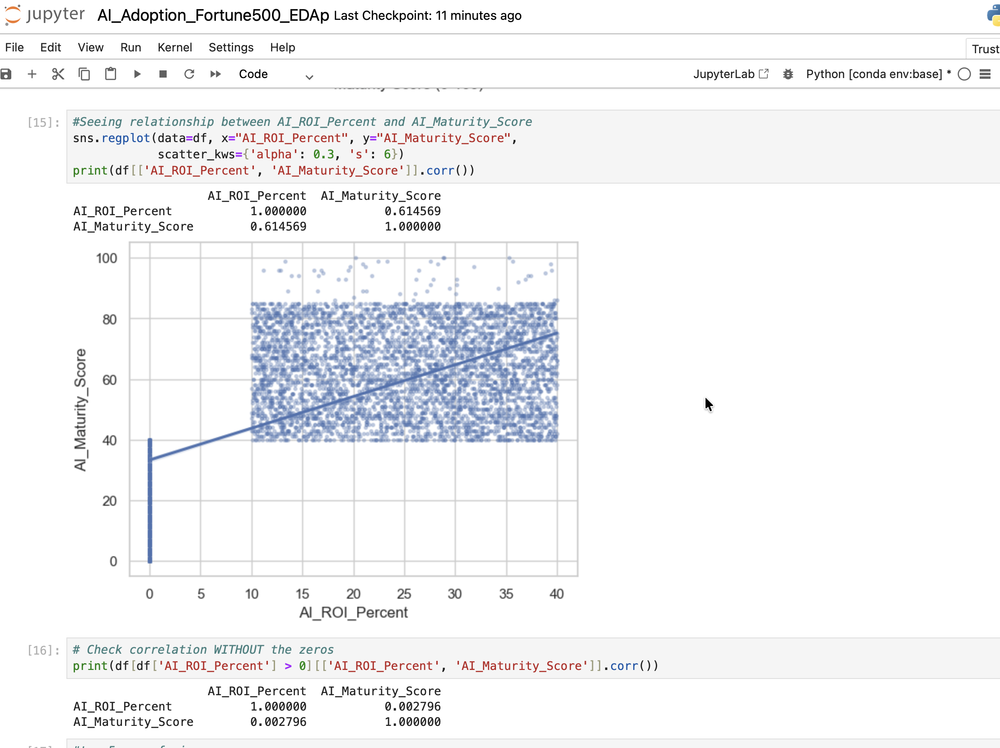

# AnikaTowsin-AI-Adoption-in-Fortune-500-Companies-2020-2025-Analysis-Using-Python
An Exploratory Data Analysis (EDA) investigating the 'AI Productivity Paradox.' This project uses Python to clean and analyze Fortune 500 data, testing the correlation between AI Maturity and ROI across diverse industries to determine if AI's financial impact matches the theoretical hype.
### 📊 Key Visualization

Conclusion:

Sector Dominance:The "Technology," "Finance," and "Telecom" sectors lead in volume,Conversely, traditional sectors like "Automotive" and "Industrial" show significantly lower representation in this dataset.

Top Performers: Companies such as HSBC, BP, and Apple emerge as leaders in AI Maturity, maintaining average scores near or above 90.

Correlation Paradox: While there is a general positive trend between AI Maturity and ROI (as seen in the initial regression), the correlation weakens significantly (r≈0.003) when excluding companies with 0% ROI. This suggests that while AI maturity is necessary, it is not a guaranteed driver of immediate ROI for all firms.

High-Yield Use Cases: Generative AI, Robotics, and AI Trading provide the highest average ROI (all hovering around 25%), indicating that specific applications of AI are more financially lucrative than others.

Scale Independence: The log-scale analysis of Revenue vs. AI Maturity shows that AI maturity is distributed across companies of all sizes.

Volatility in Growth: AI Maturity and ROI have not followed a perfectly linear path. There was a notable peak in maturity around 2023, followed by a slight stabilization.

Efficiency Gains: While ROI distribution has remained relatively stable (as shown in the boxplots), the consistency of high-revenue outcomes linked to AI has increased over the five-year period.The companies with Ai Matutity over 70 is mostly on the highest revenue.
